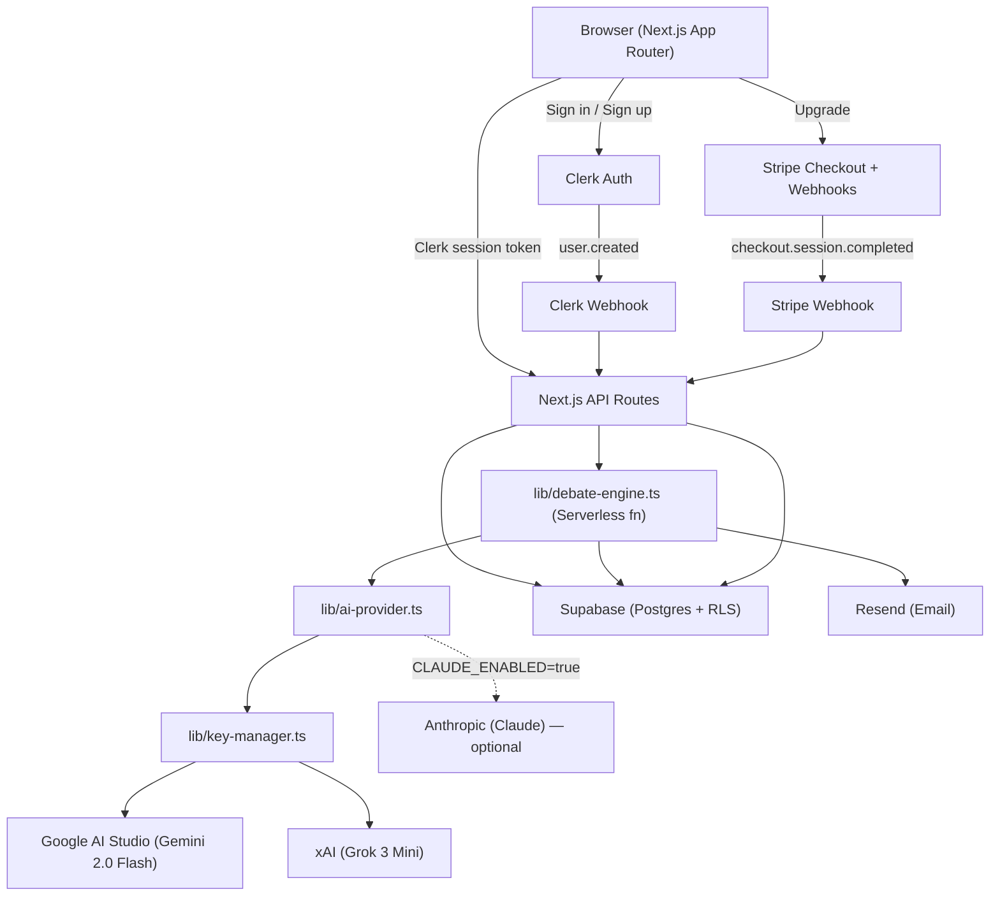
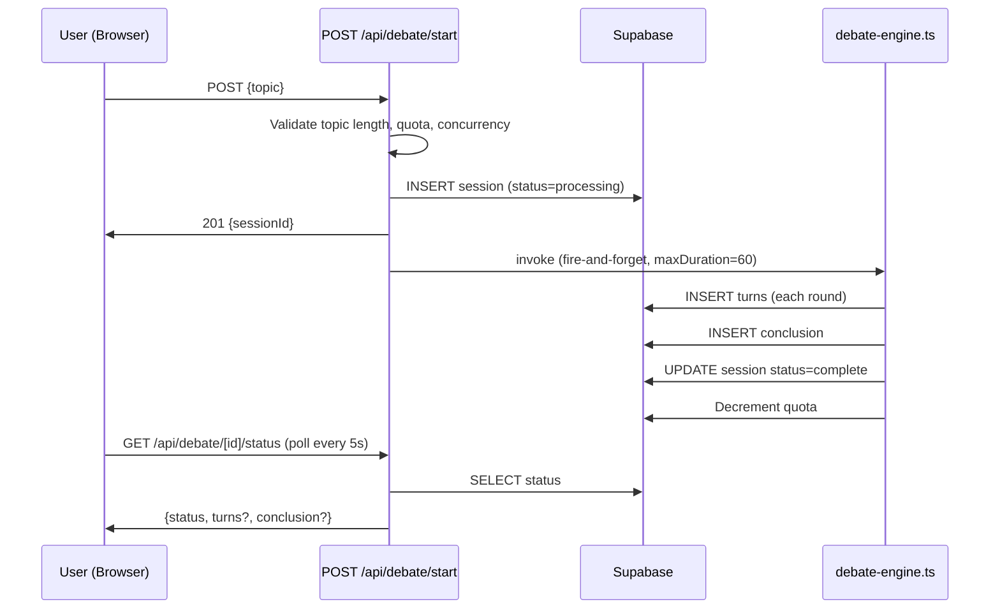
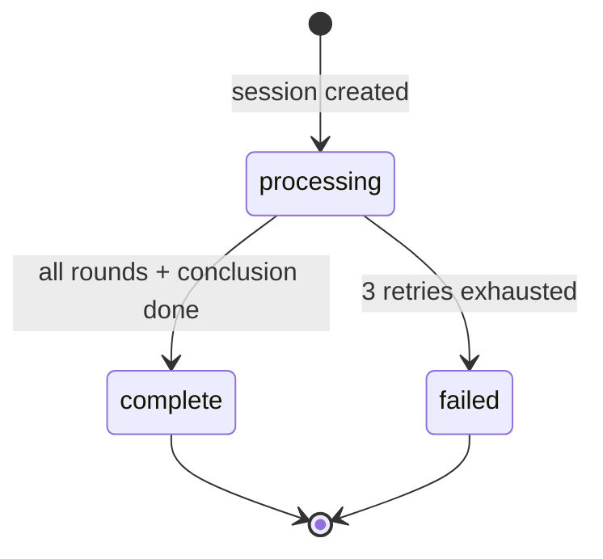

# Design Document: TUSK MVP

## Overview

TUSK is an AI debate platform where users submit a topic and two AI agents — Gemini 2.0 Flash (FOR) as Agent A and Grok 3 Mini (AGAINST) as Agent B — debate it across multiple rounds, producing a structured transcript and conclusion. The platform is monetised via three subscription tiers (Free, Starter, Pro) billed in INR.

Claude (Anthropic) is supported as a zero-code upgrade path for Agent A: set `CLAUDE_ENABLED=true` and `ANTHROPIC_API_KEY` in `.env.local` and Agent A automatically switches to `claude-sonnet-4-5`.

The existing Next.js 14 codebase provides the visual foundation: Tailwind CSS design system, TUSK branding, Geist fonts, dark-mode Dither background, and a set of reusable UI components (`Button`, `Card`, `Tooltip`, `InfiniteSlider`, `ProgressiveBlur`, `TextEffect`, `AnimatedGroup`). The MVP builds on top of this without replacing it.

### Key Design Decisions

- **Gemini + Grok as free-tier AI providers**: Both Google AI Studio (Gemini 2.0 Flash) and xAI (Grok 3 Mini) offer generous free tiers. Up to 5 API keys per provider are rotated by `lib/key-manager.ts` to maximise throughput without cost.
- **Multi-key rotation with rate-limit tracking**: `lib/key-manager.ts` tracks requests-per-minute and requests-per-day per key. On a 429 response the key is blocked for 65 seconds and the next available key is tried.
- **Claude as a drop-in upgrade**: `lib/ai-provider.ts` checks `CLAUDE_ENABLED` at startup. When true, `callAgentA` and `callConclusion` route to Claude via `@anthropic-ai/sdk` (dynamic import, no bundle cost when disabled).
- **Serverless debate execution**: Vercel serverless functions with `maxDuration=60` handle the debate engine. This avoids a separate worker process while staying within Vercel's free/hobby tier constraints.
- **Polling over WebSockets**: The debate view polls `/api/debate/[id]/status` every 5 seconds. This is simpler to implement on Vercel serverless than persistent WebSocket connections and sufficient for the MVP.
- **Supabase Row-Level Security (RLS)**: All user-scoped data is protected at the database layer, not just the API layer.
- **Clerk for auth**: Clerk webhooks sync user creation to Supabase; the Clerk session token is forwarded to all API routes via the `@clerk/nextjs` middleware.

---

## Architecture



### Request Flow: Debate Submission



---

## Components and Interfaces

### Pages

| Route | Auth | Description |
|---|---|---|
| `/` | Public | Landing page |
| `/dashboard` | Required | Session list + quota usage |
| `/debate/new` | Required | Topic submission form |
| `/debate/[id]` | Required (owner) | Debate view with polling |
| `/share/[id]` | Public | Read-only completed debate |
| `/pricing` | Public | Tier comparison + upgrade |
| `/settings` | Required | Display name + notifications |

### API Routes

| Route | Method | Auth | Description |
|---|---|---|---|
| `/api/webhooks/clerk` | POST | Svix signature | Sync user to Supabase |
| `/api/webhooks/stripe` | POST | Stripe signature | Update subscription/quota |
| `/api/debate/start` | POST | Clerk JWT | Create session + invoke engine |
| `/api/debate/[id]` | GET | Clerk JWT (owner) | Full session data |
| `/api/debate/[id]/status` | GET | Clerk JWT (owner) | Lightweight status poll |
| `/api/subscription/checkout` | POST | Clerk JWT | Create Stripe Checkout session |
| `/api/user/me` | GET / PATCH | Clerk JWT | Read/update user profile |

### React Components

```
components/
  debate/
    DebateCard.tsx        — Session card for dashboard list
    TurnBubble.tsx        — Single agent turn with FOR/AGAINST badge
    ConclusionPanel.tsx   — Structured conclusion display + download
  dashboard/
    SessionList.tsx       — Paginated list of DebateCards
    UsageBar.tsx          — Quota progress bar (used / limit)
  shared/
    Navbar.tsx            — Authenticated nav (extends HeroHeader)
    PricingTable.tsx      — Three-column tier comparison
```

### lib/ Modules

| File | Responsibility |
|---|---|
| `lib/key-manager.ts` | Rotates up to 5 API keys per provider; tracks RPM/RPD; blocks keys on 429 for 65s |
| `lib/gemini.ts` | Google Generative AI wrapper; calls `gemini-2.0-flash`; retries on 429 via key-manager |
| `lib/grok.ts` | xAI Grok wrapper via fetch; calls `grok-3-mini`; retries on 429 via key-manager |
| `lib/ai-provider.ts` | Unified `callAgentA`, `callAgentB`, `callConclusion`, `getAgentNames`; routes to Claude when enabled |
| `lib/supabase.ts` | Supabase client (server + browser), typed helpers |
| `lib/debate-engine.ts` | Orchestrates rounds via `ai-provider.ts`; retries; saves turns/conclusion; decrements quota |
| `lib/stripe.ts` | Stripe client, `createCheckoutSession`, `constructEvent` |
| `lib/resend.ts` | Resend client, `sendDebateNotification` |
| `lib/quota.ts` | `checkQuota`, `decrementQuota`, `resetMonthlyQuota` |

---

## Data Models

### Supabase Tables

#### `users`
```sql
CREATE TABLE users (
  id            TEXT PRIMARY KEY,          -- Clerk user ID
  email         TEXT NOT NULL UNIQUE,
  display_name  TEXT,
  tier          TEXT NOT NULL DEFAULT 'free',  -- 'free' | 'starter' | 'pro'
  quota_used    INTEGER NOT NULL DEFAULT 0,
  quota_limit   INTEGER NOT NULL DEFAULT 3,
  quota_reset_at TIMESTAMPTZ NOT NULL,
  stripe_customer_id TEXT,
  stripe_subscription_id TEXT,
  notify_email  BOOLEAN NOT NULL DEFAULT true,
  created_at    TIMESTAMPTZ NOT NULL DEFAULT now()
);
```

#### `sessions`
```sql
CREATE TABLE sessions (
  id          UUID PRIMARY KEY DEFAULT gen_random_uuid(),
  user_id     TEXT NOT NULL REFERENCES users(id) ON DELETE CASCADE,
  topic       TEXT NOT NULL CHECK (char_length(topic) <= 500),
  status      TEXT NOT NULL DEFAULT 'processing',  -- 'processing' | 'complete' | 'failed'
  rounds      INTEGER NOT NULL,                    -- 2 | 3 | 5
  error_msg   TEXT,
  share_slug  TEXT UNIQUE,                         -- for /share/[slug]
  created_at  TIMESTAMPTZ NOT NULL DEFAULT now(),
  updated_at  TIMESTAMPTZ NOT NULL DEFAULT now()
);
```

#### `turns`
```sql
CREATE TABLE turns (
  id          UUID PRIMARY KEY DEFAULT gen_random_uuid(),
  session_id  UUID NOT NULL REFERENCES sessions(id) ON DELETE CASCADE,
  round_num   INTEGER NOT NULL,   -- 1-based round number
  agent       TEXT NOT NULL,      -- 'A' (Gemini/Claude FOR) | 'B' (Grok AGAINST)
  content     TEXT NOT NULL,
  token_count INTEGER,
  created_at  TIMESTAMPTZ NOT NULL DEFAULT now()
);
```

#### `conclusions`
```sql
CREATE TABLE conclusions (
  id          UUID PRIMARY KEY DEFAULT gen_random_uuid(),
  session_id  UUID NOT NULL UNIQUE REFERENCES sessions(id) ON DELETE CASCADE,
  content     TEXT NOT NULL,
  created_at  TIMESTAMPTZ NOT NULL DEFAULT now()
);
```

#### `notifications_log`
```sql
CREATE TABLE notifications_log (
  id          UUID PRIMARY KEY DEFAULT gen_random_uuid(),
  session_id  UUID NOT NULL REFERENCES sessions(id) ON DELETE CASCADE,
  recipient   TEXT NOT NULL,
  status      TEXT NOT NULL,   -- 'sent' | 'failed'
  error_msg   TEXT,
  created_at  TIMESTAMPTZ NOT NULL DEFAULT now()
);
```

### TypeScript Types

```typescript
// types/index.ts additions

export type Tier = 'free' | 'starter' | 'pro';
export type SessionStatus = 'processing' | 'complete' | 'failed';
export type Agent = 'A' | 'B';
export type NotificationStatus = 'sent' | 'failed';

export interface TierConfig {
  tier: Tier;
  label: string;
  priceINR: number;
  quotaLimit: number;
  rounds: number;
}

export const TIER_CONFIG: Record<Tier, TierConfig> = {
  free:    { tier: 'free',    label: 'Explorer', priceINR: 0,   quotaLimit: 3,  rounds: 2 },
  starter: { tier: 'starter', label: 'Builder',  priceINR: 299, quotaLimit: 20, rounds: 3 },
  pro:     { tier: 'pro',     label: 'Pro',       priceINR: 799, quotaLimit: 60, rounds: 5 },
};

export const DEBATE_LIMITS = {
  MAX_TOKENS_PER_TURN:    300,
  MAX_TURNS_PER_SESSION:  12,
  MAX_TOPIC_LENGTH:       500,
  MAX_CONCURRENT_DEBATES: 3,
  MAX_RETRIES:            3,
} as const;
```

### AI Provider Layer

```typescript
// lib/ai-provider.ts — actual implementation

// Agent A = Gemini 2.0 Flash (upgrades to Claude when CLAUDE_ENABLED=true)
export async function callAgentA(systemPrompt, userMessage): Promise<string>

// Agent B = Grok 3 Mini (always)
export async function callAgentB(systemPrompt, userMessage): Promise<string>

// Conclusion = same as Agent A
export async function callConclusion(systemPrompt, userMessage): Promise<string>

// Returns { agentA: 'Gemini' | 'Claude', agentB: 'Grok' }
export function getAgentNames(): { agentA: string; agentB: string }
```

### Key Manager Rate Limits

| Provider | Keys | RPM limit | RPD limit | Block duration on 429 |
|---|---|---|---|---|
| Gemini (Google AI Studio) | Up to 5 | 14 | 1400 | 65 seconds |
| Grok (xAI) | Up to 5 | 25 | 500 | 65 seconds |

### Debate Engine State Machine



---

## Correctness Properties

*A property is a characteristic or behavior that should hold true across all valid executions of a system — essentially, a formal statement about what the system should do. Properties serve as the bridge between human-readable specifications and machine-verifiable correctness guarantees.*

### Property 1: Topic length validation is symmetric

*For any* string submitted as a debate topic, the client-side validation result (accept/reject) SHALL equal the server-side validation result — a topic accepted by the client is never rejected by the server for length, and vice versa.

**Validates: Requirements 3.3, 11.4**

---

### Property 2: Quota decrement is bounded

*For any* user and any sequence of completed or failed debate sessions, the user's `quota_used` SHALL never exceed `quota_limit`, and SHALL equal the count of sessions with status `complete` or `failed` created since the last quota reset.

**Validates: Requirements 4.8, 7.6**

---

### Property 3: Turn token count is bounded

*For any* debate session and any turn generated by Agent A or Agent B, the token count of that turn SHALL be at most 300 (`MAX_TOKENS_PER_TURN`).

**Validates: Requirements 4.3, 11.1**

---

### Property 4: Turn count per session is bounded

*For any* debate session and any tier, the total number of turns persisted SHALL be at most 12 (`MAX_TURNS_PER_SESSION`) and SHALL equal exactly `rounds * 2` for a successfully completed session.

**Validates: Requirements 4.2, 4.4, 11.2**

---

### Property 5: Conclusion exists iff session is complete

*For any* debate session, a row in the `conclusions` table exists if and only if the session's status is `complete`.

**Validates: Requirements 4.5, 4.6**

---

### Property 6: Shared view requires complete status

*For any* session ID, the `/share/[id]` route SHALL return viewable debate content if and only if the session's status is `complete` — returning a not-available message for `processing`/`failed` and 404 for non-existent IDs.

**Validates: Requirements 6.1, 6.2**

---

### Property 7: Notification log completeness

*For any* debate session that transitions to `complete` or `failed` with email notifications enabled for the user, there SHALL exist at least one row in `notifications_log` for that session recording the attempt outcome (sent or failed).

**Validates: Requirements 9.1, 9.2, 9.3**

---

### Property 8: Limit violations return HTTP 422

*For any* API request that violates an enforced server-side limit (topic length > 500, quota exhausted, or concurrent processing sessions ≥ 3), the server SHALL return HTTP 422 with a descriptive error code in the response body.

**Validates: Requirements 11.3, 11.5**

---

### Property 9: Quota reset matches tier config

*For any* user with any subscription tier, after a monthly quota reset, `quota_used` SHALL equal 0 and `quota_limit` SHALL equal the tier's configured limit (3 for Free, 20 for Starter, 60 for Pro).

**Validates: Requirements 7.6**

---

### Property 10: Session ownership enforces 404

*For any* authenticated user and any session ID that belongs to a different user, the `/api/debate/[id]` and `/api/debate/[id]/status` routes SHALL return HTTP 404.

**Validates: Requirements 5.6**

---

### Property 11: Webhook signature rejection

*For any* HTTP request to the Clerk or Stripe webhook endpoints with an invalid or missing signature, the Platform SHALL return HTTP 400 and make no changes to the database.

**Validates: Requirements 1.4, 7.5**

---

## Error Handling

### AI API Errors

The debate engine retries each AI API call up to 3 times with exponential backoff (1s, 2s, 4s). After 3 failures, the session is marked `failed` and the error message is stored in `sessions.error_msg`. The quota is still decremented on failure (Requirement 4.8).

```typescript
async function callWithRetry<T>(
  fn: () => Promise<T>,
  retries = DEBATE_LIMITS.MAX_RETRIES
): Promise<T> {
  for (let attempt = 0; attempt < retries; attempt++) {
    try {
      return await fn();
    } catch (err) {
      if (attempt === retries - 1) throw err;
      await sleep(1000 * 2 ** attempt);
    }
  }
  throw new Error('unreachable');
}
```

### Webhook Signature Failures

Both Clerk and Stripe webhooks verify signatures before processing. On failure, the route returns HTTP 400 immediately without touching the database.

### Quota / Concurrency Violations

Server-side checks in `POST /api/debate/start` return HTTP 422 with a structured error body:

```json
{ "error": "QUOTA_EXHAUSTED" | "CONCURRENCY_LIMIT" | "TOPIC_TOO_LONG" | "TOPIC_EMPTY" }
```

The client maps these codes to user-facing messages.

### Session Ownership

`GET /api/debate/[id]` and `GET /api/debate/[id]/status` verify that the authenticated user's Clerk ID matches `sessions.user_id`. Mismatches return HTTP 404 (not 403, to avoid leaking session existence).

### Vercel Timeout

The debate engine runs inside a Vercel serverless function with `maxDuration=60`. If the function times out before completion, the session remains in `processing` status. A background cron job (or manual admin action) can detect stale `processing` sessions older than 5 minutes and mark them `failed`.

---

## Testing Strategy

### Unit Tests (Vitest)

Focus on pure logic that doesn't require external services:

- `lib/quota.ts`: `checkQuota`, `decrementQuota` — verify boundary conditions
- `lib/key-manager.ts`: key rotation, RPM/RPD counter reset, 429 block/unblock logic
- `lib/debate-engine.ts`: round orchestration logic with mocked `ai-provider.ts`
- Topic validation: empty string, whitespace-only, exactly 500 chars, 501 chars
- Tier config: verify `TIER_CONFIG` values match requirements
- Webhook signature helpers: valid and invalid payloads

### Property-Based Tests (fast-check)

Using [fast-check](https://github.com/dubzzz/fast-check) (TypeScript-native PBT library). Each property test runs a minimum of 100 iterations.

**Property 1 — Topic length validation symmetry**
```
Feature: tusk-mvp, Property 1: topic length validation is symmetric
```
Generate arbitrary strings of length 0–1000. Assert `validateTopicClient(s) === validateTopicServer(s)` for all inputs.

**Property 2 — Quota decrement is bounded**
```
Feature: tusk-mvp, Property 2: quota decrement is bounded
```
Generate a user with a random tier and a random sequence of session completions/failures. Assert `quota_used <= quota_limit` after each operation and `quota_used` equals the count of terminal sessions.

**Property 3 — Turn token count is bounded**
```
Feature: tusk-mvp, Property 3: turn token count is bounded
```
Generate random debate topics and mock AI responses. Assert every turn's `token_count <= 300`.

**Property 4 — Turn count per session is bounded**
```
Feature: tusk-mvp, Property 4: turn count per session is bounded
```
Generate sessions for each tier with mocked AI. Assert total turns ≤ 12 and equals `rounds * 2` for complete sessions.

**Property 5 — Conclusion exists iff session is complete**
```
Feature: tusk-mvp, Property 5: conclusion exists iff session is complete
```
Simulate session lifecycle transitions. Assert the conclusion presence invariant holds after each state change.

**Property 6 — Shared view requires complete status**
```
Feature: tusk-mvp, Property 6: shared view requires complete status
```
Generate sessions with random statuses. Assert the share route returns viewable content if and only if status is `complete`.

**Property 7 — Notification log completeness**
```
Feature: tusk-mvp, Property 7: notification log completeness
```
Generate sessions transitioning to `complete`/`failed` with notifications enabled. Assert a `notifications_log` row exists for each.

**Property 8 — Limit violations return HTTP 422**
```
Feature: tusk-mvp, Property 8: limit violations return HTTP 422
```
Generate requests violating each server-side limit. Assert HTTP 422 with a descriptive error code for all violations.

**Property 9 — Quota reset matches tier config**
```
Feature: tusk-mvp, Property 9: quota reset matches tier config
```
Generate users with random tiers. Run quota reset. Assert `quota_used=0` and `quota_limit` matches the tier's configured value.

**Property 10 — Session ownership enforces 404**
```
Feature: tusk-mvp, Property 10: session ownership enforces 404
```
Generate (userId, sessionId) pairs where userId ≠ session.user_id. Assert HTTP 404 from the debate API routes.

**Property 11 — Webhook signature rejection**
```
Feature: tusk-mvp, Property 11: webhook signature rejection
```
Generate arbitrary payloads with invalid/missing signatures for both Clerk and Stripe webhook endpoints. Assert HTTP 400 and no DB mutations.

### Integration Tests

- Clerk webhook: valid `user.created` payload creates a `users` row
- Stripe webhook: `checkout.session.completed` updates tier and quota
- Debate engine end-to-end: mock `callAgentA` / `callAgentB` via `ai-provider.ts`, verify full session lifecycle
- Share route: returns 404 for non-existent IDs, 200 for complete sessions

### Smoke Tests

- Supabase connection and RLS policies are active
- Clerk middleware protects `/dashboard`, `/debate/*`, `/settings`
- Gemini key responds to a test prompt (at least one `GEMINI_KEY_*` set)
- Grok key responds to a test prompt (at least one `GROK_KEY_*` set)
- Stripe webhook secret is configured
- Resend API key is valid
